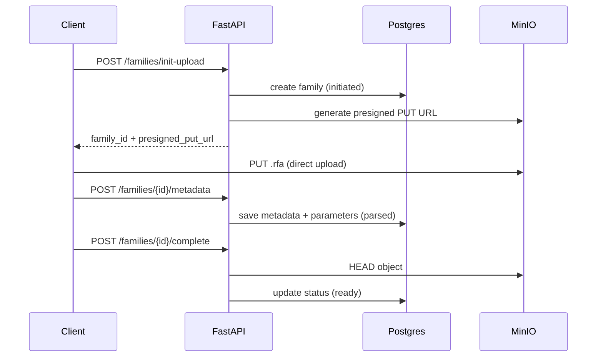
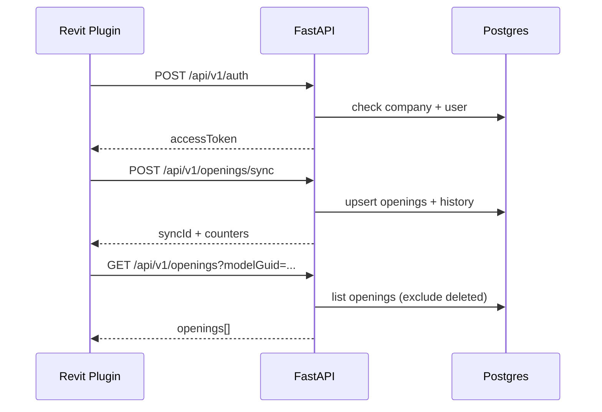

# Описание реализованного FastAPI-бэкенда

Документ фиксирует текущее состояние backend-сервиса **Revit Families Backend** (`backet/`) на момент pre-work анализа проекта.

---

## 1. Назначение

Backend обслуживает два направления:

| Направление | Назначение | Клиент |
|---|---|---|
| **Families** | Загрузка семейств Revit (`.rfa`) в S3-совместимое хранилище, сохранение метаданных в Postgres, выдача presigned URL | Веб/внутренние сервисы |
| **Openings** | Синхронизация реестра отверстий из Revit-модели (плагин), soft-delete, история изменений | Revit-плагин |

Сервис поднимается в Docker Compose как контейнер `backend` на порту **8000**.

---

## 2. Технологический стек

| Компонент | Технология | Версия (requirements.txt) |
|---|---|---|
| Web-фреймворк | FastAPI | 0.110.3 |
| ASGI-сервер | Uvicorn | 0.30.1 |
| ORM | SQLAlchemy (async) | 2.0.30 |
| Драйвер БД | asyncpg | 0.29.0 |
| Валидация / настройки | Pydantic v2, pydantic-settings | 2.7.3 / 2.3.1 |
| S3-клиент | boto3 / botocore | 1.34.148 |
| JWT | python-jose | 3.3.0 |
| Логирование | structlog | 24.2.0 |
| Retry | tenacity | 8.3.0 |

**Runtime:** Python 3.12 (Dockerfile).

**Внешние зависимости:**
- PostgreSQL 16
- MinIO (S3-compatible storage)

---

## 3. Структура приложения

```
backet/
├── app/
│   ├── main.py                 # Точка входа FastAPI, регистрация роутеров
│   ├── api/routers/            # HTTP-эндпоинты
│   │   ├── auth.py
│   │   ├── families.py
│   │   ├── health.py
│   │   ├── openings.py
│   │   └── projects.py
│   ├── core/
│   │   ├── config.py           # Settings из .env
│   │   └── logging.py          # structlog JSON
│   ├── db/
│   │   ├── models.py           # SQLAlchemy-модели (3 схемы Postgres)
│   │   ├── session.py          # async engine + get_session
│   │   └── repositories/       # Запросы к БД
│   ├── schemas/                # Pydantic-схемы запросов/ответов
│   ├── services/               # Бизнес-логика
│   │   ├── auth.py
│   │   ├── families.py
│   │   ├── openings.py
│   │   └── s3.py
│   └── utils/
│       └── filename.py         # Санитизация имён файлов
├── migrations/                 # SQL-миграции (ручное применение)
├── Dockerfile
└── requirements.txt
```

**Слои:** Router → Service → Repository → DB / S3.

---

## 4. Регистрация роутеров

В `main.py` используются **два префикса маршрутизации**:

```python
# Префикс /api/v1 — auth, health, openings
api_v1_router = APIRouter(prefix="/api/v1")

# Без префикса — families, projects
app.include_router(families.router)   # /families/...
app.include_router(projects.router)   # /projects/...
```

| Группа | Базовый путь | Auth-зависимость |
|---|---|---|
| Auth | `/api/v1/auth` | Нет (публичный login) |
| Health | `/api/v1/health`, `/health`, `/healthz` | Нет |
| Openings | `/api/v1/openings` | `get_plugin_user` |
| Families | `/families` | `get_current_user` |
| Projects | `/projects` | `get_current_user` |

Swagger UI: `http://localhost:8000/docs`

---

## 5. API-эндпоинты

### 5.1. Health

| Метод | Путь | Описание |
|---|---|---|
| GET | `/api/v1/health` | Проверка живости (`{"status": "ok"}`) |
| GET | `/health`, `/healthz` | Legacy-эндпоинты (скрыты из OpenAPI) |

### 5.2. Auth (плагин Revit)

| Метод | Путь | Описание |
|---|---|---|
| POST | `/api/v1/auth` | Аутентификация по `companyId` + `windowsUser` |

**Запрос:**
```json
{
  "companyId": "COMPANY_CODE",
  "windowsUser": "DOMAIN\\user"
}
```

**Ответ:**
```json
{
  "accessToken": "<JWT>",
  "expiresIn": 28800
}
```

**Логика (`services/auth.py`):**
1. Проверка существования и активности компании в `atptlp_info.companies`.
2. Если в `atptlp_info.company_users` есть записи для компании — проверка, что `windowsUser` в whitelist.
3. Выдача JWT с claims: `company_id`, `windows_user`, `exp`.

### 5.3. Openings (плагин Revit)

Все эндпоинты требуют `Authorization: Bearer <token>` (plugin JWT).

| Метод | Путь | Описание |
|---|---|---|
| POST | `/api/v1/openings/sync` | Синхронизация отверстий из модели |
| GET | `/api/v1/openings?modelGuid=<uuid>` | Список отверстий модели (без deleted) |

**POST `/sync` — ключевая логика:**

- Принимает `modelGuid`, `modelName`, `scheduleName`, массив `openings`, флаги `upsertOpenings` (default: true), `softDeleteMissing` (default: false).
- Для каждого отверстия по `elementUniqueId`:
  - **created** — новая запись, статус `new`, запись в `opening_history`.
  - **updated** — изменение полей или восстановление из `deleted`.
  - **unchanged** — `contentHash` совпадает с текущим.
  - **failed** — ошибка на уровне элемента (остальные продолжают обрабатываться).
- При `softDeleteMissing=true` — отверстия модели, отсутствующие в payload и принадлежащие текущей спецификации (`scheduleName`), помечаются `deleted`.
- Ответ: счётчики `created/updated/softDeleted/unchanged/failed`, `syncId`, детализация по каждому элементу.

**GET — возвращает:**
- `elementUniqueId`, `openingId`, `status`, `scheduleName`
- `openingRevisionStatus` — из extra-поля `ATP_OPN_Статус отверстия`
- `contentHash`, `updatedAt`

### 5.4. Families (менеджер семейств)

Все эндпоинты требуют `Authorization: Bearer <token>` (user JWT с claim `sub`).

| Метод | Путь | Описание |
|---|---|---|
| POST | `/families/init-upload` | Инициализация загрузки, presigned PUT URL |
| POST | `/families/{family_id}/metadata` | Сохранение метаданных семейства |
| POST | `/families/{family_id}/complete` | Завершение загрузки (HEAD S3, смена статуса) |
| GET | `/families/{family_id}` | Карточка семейства |
| GET | `/families/{family_id}/download-url` | Presigned GET URL для скачивания |

**Жизненный цикл семейства:**

```
initiated → uploaded → parsed → ready
                              ↘ failed
```

1. **init-upload** — создаёт запись в БД (`status=initiated`), формирует `object_key`, возвращает presigned PUT URL.
2. **metadata** — сохраняет JSON метаданных + нормализует параметры в `family_parameters` и `family_type_values`, статус → `parsed`.
3. **complete** — HEAD-запрос к S3 (best effort), обновляет `etag`, `size_bytes`, `uploaded_at`, статус → `ready` или `uploaded`.

**Формат object_key:**
```
projects/{project_id}/families/{family_id}/{sha256}.rfa
```
или `{sanitized_filename}.rfa`, если sha256 не передан.

### 5.5. Projects

| Метод | Путь | Описание |
|---|---|---|
| GET | `/projects/{project_id}/families?limit=50&offset=0` | Список семейств проекта с пагинацией |

---

## 6. Аутентификация и авторизация

Реализованы **две независимые модели** JWT:

### 6.1. UserContext (Families / Projects)

- JWT claim: `sub` — UUID пользователя.
- Авторизация: таблица `ATPTLP_familymanager.user_projects` — список доступных `project_id`.
- Проверка доступа: `_ensure_access(user, project_id)` в `services/families.py`.

> **Примечание:** README описывает ручную генерацию тестового токена с `sub`. Отдельного login-эндпоинта для этой модели **нет** — только для plugin auth.

### 6.2. PluginUserContext (Openings)

- JWT claims: `company_id`, `windows_user`.
- Получение токена: `POST /api/v1/auth`.
- При каждом запросе повторно проверяется активность компании и whitelist пользователей.

---

## 7. Модель данных (PostgreSQL)

Три схемы:

### 7.1. `ATPTLP_familymanager`

| Таблица | Назначение |
|---|---|
| `families` | Семейства Revit: S3-путь, статус, метаданные JSONB |
| `family_parameters` | Каталог параметров семейства (для фильтрации) |
| `family_type_values` | Значения параметров по типам |
| `user_projects` | Связь user → project (авторизация) |

**Статусы семейства:** `initiated`, `uploaded`, `parsed`, `ready`, `failed`.

### 7.2. `ATPTLP_openmodels`

| Таблица | Назначение |
|---|---|
| `openings` | Реестр отверстий модели (OPN_Database) |
| `opening_history` | Аудит: created, updated, softDeleted, statusChanged |

**Статусы отверстия:** `new`, `in_review`, `approved`, `rejected`, `deleted`.

Уникальный ключ: `(model_guid, element_unique_id)`.

### 7.3. `atptlp_info`

| Таблица | Назначение |
|---|---|
| `companies` | Компании (`company_id`, `is_active`) |
| `company_users` | Whitelist Windows-пользователей по компании |

---

## 8. Интеграция с S3 (MinIO)

Класс `S3Service` (`services/s3.py`):

| Метод | Назначение |
|---|---|
| `generate_put_url` | Presigned URL для загрузки `.rfa` |
| `generate_get_url` | Presigned URL для скачивания |
| `head_object` | Проверка наличия объекта при complete |

**Особенности:**
- Два boto3-клиента: внутренний (`MINIO_ENDPOINT`) и публичный для presign (`MINIO_PUBLIC_ENDPOINT`).
- Path-style addressing, signature v4.
- TTL presigned URL настраивается: `PRESIGNED_PUT_EXPIRES` (900 с), `PRESIGNED_GET_EXPIRES` (300 с).

---

## 9. Конфигурация

Настройки через `.env` / переменные окружения (`core/config.py`):

| Переменная | Назначение | Default |
|---|---|---|
| `DATABASE_URL` | Postgres async URL | — (обязательно) |
| `MINIO_ENDPOINT` | Внутренний endpoint MinIO | — |
| `MINIO_PUBLIC_ENDPOINT` | Endpoint для presigned URL (клиент) | = MINIO_ENDPOINT |
| `MINIO_ACCESS_KEY` / `MINIO_SECRET_KEY` | Credentials | — |
| `MINIO_BUCKET_FAMILIES` | Bucket для семейств | — |
| `MINIO_REGION` | Регион | `us-east-1` |
| `MINIO_USE_SSL` | SSL | `false` |
| `JWT_SECRET` | Секрет подписи JWT | — |
| `JWT_ALGORITHM` | Алгоритм | `HS256` |
| `JWT_EXPIRES_SECONDS` | TTL plugin-токена | `28800` (8 ч) |
| `LOG_LEVEL` | Уровень логирования | `INFO` |

---

## 10. Миграции

SQL-файлы в `backet/migrations/` (применяются **вручную**):

| Файл | Содержание |
|---|---|
| `001_init.sql` | Схема `ATPTLP_familymanager`: families, parameters, type_values, user_projects |
| `002_openings.sql` | Схема `ATPTLP_openmodels`: openings, opening_history |
| `003_companies.sql` | Схема `atptlp_info`: companies, company_users |
| `004_openings_content_hash.sql` | Добавление колонки `content_hash` |

Автоматического migration runner (Alembic и т.п.) **нет**.

---

## 11. Логирование

- `structlog` с JSON-рендером в stdout.
- События: `jwt_decode_failed`, `s3_head_object_error`, `opening_sync_item_failed` и др.
- Уровень задаётся через `LOG_LEVEL`.

---

## 12. Развёртывание

**Docker Compose** (`docker-compose.yml`):
- Сервис `backend` собирается из `./backet`, зависит от `postgres` и `minio`.
- Порт: `8000:8000`.
- Переменные пробрасываются из `.env`.

**Локальный запуск без Docker:**
```bash
cd backet
python -m venv .venv
pip install -r requirements.txt
uvicorn app.main:app --reload
```

---

## 13. Что реализовано / что нет

### Реализовано

- [x] FastAPI-приложение с разделением router / service / repository
- [x] Async SQLAlchemy + Postgres
- [x] Загрузка семейств через presigned S3 URL (init → metadata → complete)
- [x] Список семейств проекта с пагинацией
- [x] Синхронизация отверстий из Revit-плагина (upsert, soft delete, history)
- [x] Plugin auth по company + windows user
- [x] User auth по JWT `sub` + проверка project access
- [x] Health-check эндпоинты
- [x] Structured JSON logging
- [x] Docker-образ и интеграция в Compose

### Не реализовано / ограничения

- [ ] Единый префикс API (`/families` и `/projects` вне `/api/v1`)
- [ ] Login-эндпоинт для user JWT (Families) — только ручная генерация токена
- [ ] Автоматические миграции (Alembic)
- [ ] CRUD для companies / company_users через API
- [ ] Смена статуса отверстия (`in_review`, `approved`, `rejected`) через API
- [ ] Фильтрация семейств по параметрам (таблицы есть, API нет)
- [ ] Тесты (unit / integration)
- [ ] CORS, rate limiting, OpenAPI tags grouping
- [ ] `init_models()` в session.py не вызывается при старте — таблицы создаются только через SQL-миграции

---

## 14. Связь с остальной инфраструктурой

В том же `docker-compose.yml` поднимаются (но **не используются** FastAPI напрямую):

| Сервис | Порт | Назначение |
|---|---|---|
| PostgreSQL | 5432 | Общая БД (families + airflow + superset) |
| MinIO | 9000 / 9001 | S3-хранилище |
| Redis | — | Кэш для Superset |
| Airflow | 8080 | ETL / оркестрация |
| Superset | 8088 | BI / дашборды |

FastAPI использует только **Postgres** и **MinIO**.

---

## 15. Диаграмма потоков

### Загрузка семейства



### Синхронизация отверстий (плагин)



---

*Документ создан для pre-work анализа. Актуальная версия кода: `backet/app/`.*
